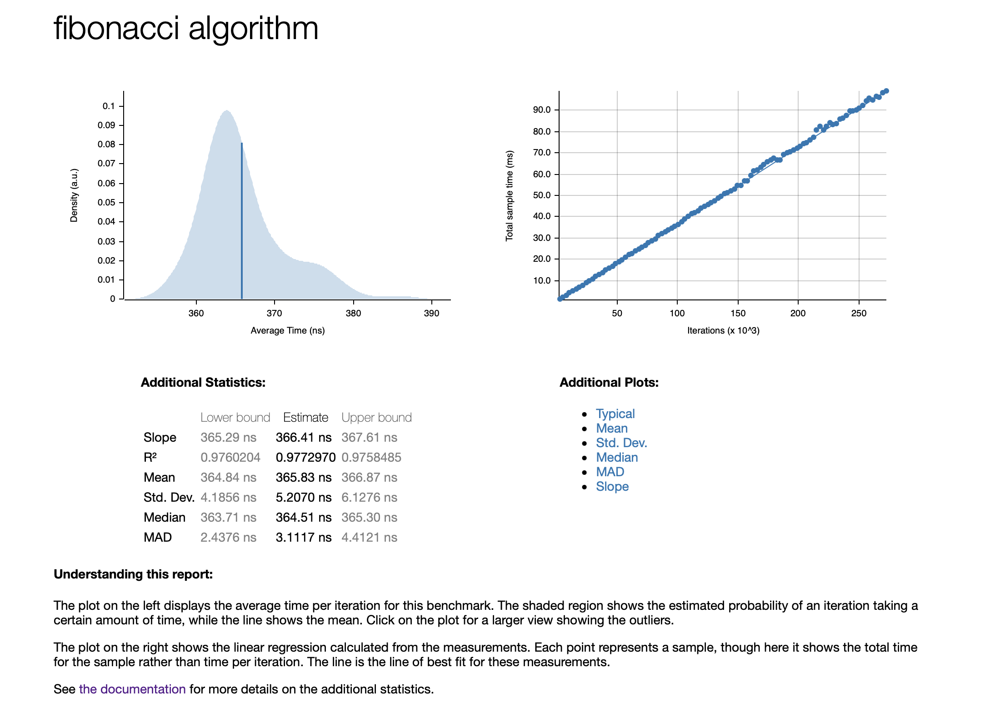

[](https://github.com/szheng3/rust-new-project-template/actions/workflows/tests.yml)
[](https://github.com/szheng3/rust-new-project-template/actions/workflows/lint.yml)
[](https://github.com/szheng3/rust-new-project-template/actions/workflows/rust.yml)
[](https://github.com/szheng3/rust-new-project-template/actions/workflows/build.yml)

# Weekly Rust Progress Report
Build a rust the domain of data engineering or machine learning engineering.

## Week 1 Progress

This week, I familiarized myself with the basics of Rust and gained hands-on experience by using the Rust Project Template (from https://github.com/nogibjj/rust-new-project-template). My first Rust project was building an API server, which provided a great opportunity for practical application of my newfound knowledge.
```

#[get("/api/health")]
async fn api_health_handler() -> HttpResponse {
    let response_json = &GenericResponse {
        status: "success".to_string(),
        message: "Health Check".to_string(),
    };
    HttpResponse::Ok().json(response_json)
}
```
### Usage

> Go to week1 `cd week1` 

> Run `make run` in the terminal, it will launch a server.

> Run `curl -v http://localhost:8000/api/health` to get the JSON response.


# Weekly Rust Progress Report


## Week 2 Progress

This week, I set up a GitHub CI/CD action pipeline for building, linking, and testing. Additionally, I utilized a Dockerfile to package my Rust services. Furthermore, I deployed the service on Google Cloud Platform using Kubernetes. You can access a demo of the setup at https://apiv2.sszzz.me.
> file is located at [.github/workflows](https://github.com/szheng3/rust-new-project-template/tree/main/.github/workflows)

Here is one of the code snippet from the CI/CD pipeline.
```
name: Rust

on:
  push:
    branches: [ "main" ]
  pull_request:
    branches: [ "main" ]

env:
  CARGO_TERM_COLOR: always

jobs:
  build:

    runs-on: ubuntu-latest

    steps:
    - uses: actions/checkout@v3
    - name: Build
      run: cargo build --verbose
    - name: Run tests
      run: cargo test --verbose
```

Here is the code from the Kubernetes deployment file.
```
apiVersion: apps/v1
kind: Deployment
metadata:
  name: rust-ml
  namespace: resume-prod
spec:
  selector:
    matchLabels:
      app: rust-ml
  replicas: 1
  template: # template for the pods
    metadata:
      labels:
        app: rust-ml
    spec:
      containers:
        - name: rust-ml
          imagePullPolicy: Always
          image: szheng3/sz-rust-ml:latest
          ports:
            - containerPort: 8000

          resources:
            requests:
              ephemeral-storage: 10Gi
              cpu: 1250m
              memory: 3Gi

      affinity:
        nodeAffinity:
          requiredDuringSchedulingIgnoredDuringExecution:
            nodeSelectorTerms:
              - matchExpressions:
                  - key: cloud.google.com/gke-spot
                    operator: In
                    values:
                      - "true"

---
apiVersion: v1
kind: Service
metadata:
  name: rust-ml
  namespace: resume-prod
spec:
  # This defines which pods are going to be represented by this Service
  # The service becomes a network endpoint for either other services
  # or maybe external users to connect to (eg browser)
  selector:
    app: rust-ml

  ports:
    - name: http
      port: 80
      targetPort: 8000
  type: ClusterIP
```

Here is the code from the Dockerfile.
```
# Use a Rust base image
FROM rust:latest

# Update the package repository and install dependencies
RUN apt-get update && \
    apt-get install -y software-properties-common python3-dev python3-pip libopenblas-dev libopenmpi-dev

WORKDIR /app

COPY . .


# Build the application
RUN cargo build --release

# Expose the application port
EXPOSE 8000

# Set the command to run when the container starts
#CMD ["./target/release/rust-new-project-template"]
CMD ["cargo", "run", "--release"]

```

## Week 3 Progress
This week, I set up a rust bench. In order to test the performance of the Rust, I write a single fibonacci sequence. The result is shown below.

```
pub fn fibonacci(n: u32) -> u32 {
    if n <= 1 {
        return n;
    }
    return fibonacci(n - 1) + fibonacci(n - 2);
}
```

### Usage
> Go to week3 `cd week3`

> Run `make bench` in the terminal, it will run the benchmark test for fibonacci.

## Benchmark Results


## Week 4 Progress
This week, I set up a rust client in order to call the API server for the price of the cryptocurrency.

```

#[tokio::main]
async fn main() -> Result<(), Box<dyn Error>> {
    let resp = reqwest::get("https://data.binance.com/api/v3/ticker/24hr")
        .await?
        .json::<Vec<Ticker>>()
        .await?;
    println!("{:#?}", resp[0]);
    Ok(())
}

```

### Usage
> Go to week4 `cd week4`

> Run `cargo run` in the terminal, it will run the client.

```
Ticker {
    symbol: "ETHBTC",
    price_change: "0.00000000",
    price_change_percent: "0.000",
    weighted_avg_price: "0.03271000",
    prev_close_price: "0.03271000",
    last_price: "0.03271000",
    last_qty: "0.00000000",
    bid_price: "0.03271000",
    bid_qty: "0.00000000",
    ask_price: "0.03272000",
    ask_qty: "0.00000000",
    open_price: "0.03271000",
    high_price: "0.03271000",
    low_price: "0.03271000",
    volume: "0.00000000",
    quote_volume: "0.00000000",
    open_time: 1620000000000,
    close_time: 1620000000000,
    first_id: 0,
    last_id: 0,
    count: 0,
}
```

## References

* [rust-cli-template](https://github.com/kbknapp/rust-cli-template)
* [server](https://codevoweb.com/build-a-simple-api-with-rust-and-actix-web/)