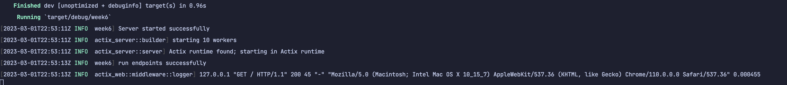

# Weekly Rust Progress Report
Build a rust the domain of data engineering or machine learning engineering.


## Week 6 Progress
This week, I set up a logging with actix_web. 

```

if std::env::var_os("RUST_LOG").is_none() {
    std::env::set_var("RUST_LOG", "actix_web=info");
}
env_logger::builder()
    .filter_level(log::LevelFilter::Info)
    .init();
```

### Usage
> Go to week6 `cd week6`

> Run `cargo run` in the terminal, it will run the client.

```
go to browser and type http://localhost:8000
```
### Results


## References

* [rust-cli-template](https://github.com/kbknapp/rust-cli-template)
