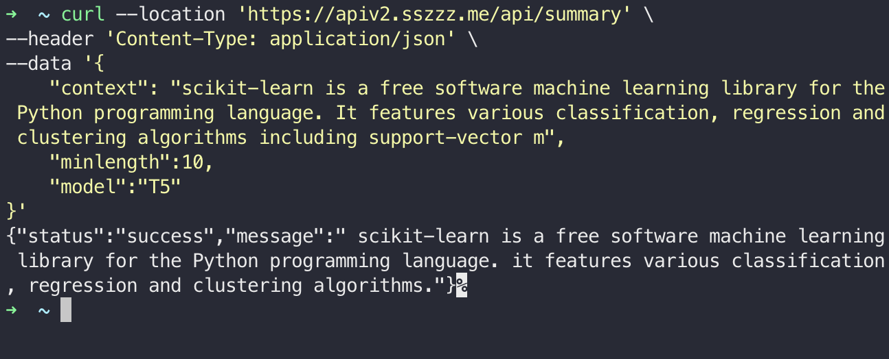

# Weekly Rust Progress Report
Build a rust the domain of data engineering or machine learning engineering.


## Week 7 Progress
This week, I set up a gpu with actix_web libtorch. Below is the Dockerfile.
The all source code is located in https://github.com/szheng3/rust-individual-project-2/tree/gpu

```


# Use a Rust base image
FROM nvidia/cuda:11.0.3-runtime-ubuntu20.04

# Update the package repository and install dependencies
# Get Ubuntu packages


# Update new packages
RUN echo 'debconf debconf/frontend select Noninteractive' | debconf-set-selections


RUN apt-get update
RUN apt-get install -y -q

RUN apt-get install dialog apt-utils -y
RUN apt-get install -y \
    build-essential \
    curl \
    pkg-config \
    libssl-dev

# Get Rust
RUN curl https://sh.rustup.rs -sSf | sh -s -- -y

# Add .cargo/bin to PATH
ENV PATH="/root/.cargo/bin:${PATH}"
ENV TORCH_CUDA_VERSION="cu117"

# Check cargo is visible
RUN cargo --help


## Add the PyTorch repository
#RUN add-apt-repository ppa:ubuntu-toolchain-r/test

# Update the package repository and install PyTorch

# Set the working directory
WORKDIR /app
# Copy the application code
COPY . .
#ENV LIBTORCH='/app/libtorch'
#ENV LD_LIBRARY_PATH='${LIBTORCH}/lib:$LD_LIBRARY_PATH'

RUN make test

# Build the application
RUN cargo build --release

# Expose the application port
EXPOSE 8000

# Set the command to run when the container starts
CMD ["cargo", "run", "--release"]

```

### Usage
> Go to week7 `docker run -d -p 8000:8000 szheng3/sz-rust-ml:latest-gpu`


```
curl --location 'http://localhost:8000/api/summary' \
--header 'Content-Type: application/json' \
--data '{
    "context": "scikit-learn is a free software machine learning library for the Python programming language. It features various classification, regression and clustering algorithms including support-vector m",
    "minlength":10,
    "model":"T5"
}'
```
### Results


## References

* [rust-cli-template](https://github.com/kbknapp/rust-cli-template)
